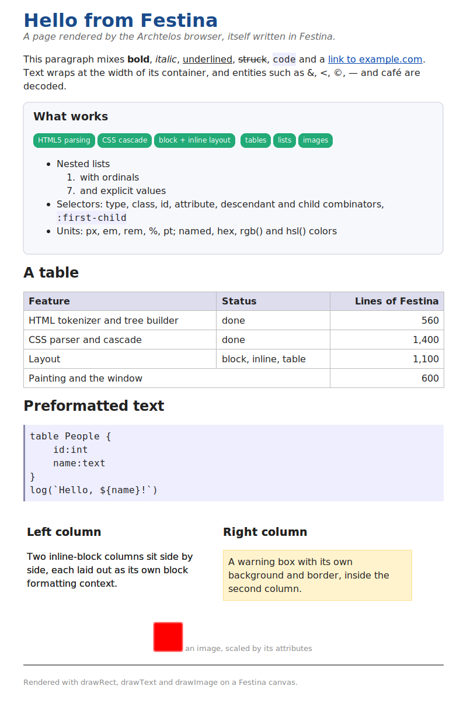

# archtelos-browser

An HTML and CSS renderer, and a small web browser, written entirely in
the [Festina](https://github.com/uraikus/festina) language.

The project has two purposes, equally weighted: render real pages
correctly, and keep finding the places where Festina is insufficient.
The renderer is real — its own HTML tokenizer and tree builder, a CSS
parser and cascade, block, inline and table layout, painting on
Festina's canvas, and an HTTP(S) client — all in one 2.8 MB native
binary that links nothing Festina does not already link. What building
it reveals about the language is in [FINDINGS.md](FINDINGS.md), and what
Festina should gain as a result is in [festina.md](festina.md).

**HTML parsing follows the
[WHATWG HTML Living Standard](https://html.spec.whatwg.org/).** Against
the standard's own tree-construction corpus it passes **1,535 of 1,652**
cases — the same number Chromium 141 passes on the same corpus, and 84
of the 117 each fails are the same cases. **CSS selectors match the same
elements Chromium matches in all 61 cases** the instrument asks. CSS
targets the [CSS Snapshot 2026](https://www.w3.org/TR/css-2026/), whose
official definition of CSS is 24 specifications; the engine implements
part of 22 and no part of 2 — Compositing and Blending, which needs a
compositing operator Festina does not expose, and Easing, which needs
the animation clock nothing here has. Where it stands on each is in
[css-2026.md](css-2026.md).



## Building and running

Point `FESTINA_HOME` at a Festina checkout and compile:

```bash
export FESTINA_HOME=/path/to/festina
sudo apt install clang libsqlite3-dev libcairo2-dev libx11-dev \
                 libjpeg-dev libmbedtls-dev pkg-config
$FESTINA_HOME/bin/festina compile browser.f -o browser

./browser examples/hello.html                     # a local file
./browser https://example.com/                    # over HTTP(S)
./browser                                          # a built-in welcome page

# headless: lay out at 900px and write a PNG of the whole document
./browser examples/hello.html --screenshot out.png --width 900
```

Inside the window:

| Input | Effect |
|---|---|
| wheel, `Up`/`Down`, `PageUp`/`PageDown`, `Home`/`End`, space | scroll |
| click a link | follow it; the target shows in the status bar on hover |
| `BackSpace`, or the `<` button | back |
| `F5` | reload |
| `F6`, or a click on the address bar | edit the address; `Return` loads, `Escape` cancels |
| resizing the window | re-layout at the new width |

`ARCHTELOS_TIMING=1` prints per-phase timings.

## What it renders

**HTML** is the standard's algorithm, not an approximation of it. The
tokenizer implements the tag, attribute, comment, doctype, RCDATA,
RAWTEXT, PLAINTEXT, script-data and script-data-escaped states, CDATA
sections, and bogus comments. Character references cover all 2,231 named
references with longest-match, the 106 legacy names that work without a
semicolon, the attribute-value rule that leaves `?a=1&copy=2` alone, and
numeric references with the standard's replacements. Tree construction
implements all 23 insertion modes, the stack of open elements with its
five scopes, the list of active formatting elements with the adoption
agency algorithm, foster parenting, template contents, quirks-mode
detection from the doctype, the `<select>` content model, and foreign
content — SVG and MathML namespaces, tag and attribute name adjustment,
and integration points.

**CSS** comes from `<style>`, `<link rel=stylesheet>` (fetched) and
`style=""`. Selectors: type, universal, `#id`, `.class`, `[attr]` with
`=`, `~=`, `^=`, `$=`, `*=`, `|=`, the descendant, child, adjacent and
general-sibling combinators, `:first-child`, `:last-child`,
`:only-child`, `:nth-child(odd|even|n)`, `:first-of-type`,
`:last-of-type`, `:root`, `:link` and `:not(compound)`. The cascade
handles specificity, source order, `!important`, inline styles and HTML
presentational attributes. The CSS-wide keywords all work: `inherit`
takes the parent's computed value, `initial` the initial one, `unset`
whichever of the two the property calls for, **`revert` rolls the
property back to the value the previous origin gave it** — the
user-agent sheet's here, because there is no user origin, and `unset`
where that origin declared nothing — and **`revert-layer` rolls it back
one step instead**, to the previous cascade layer. `all` applies any of
them to every property at once. `@media` is evaluated against the viewport,
over every feature Media Queries 3 defines — sizes, `orientation`,
`aspect-ratio`, `color`, `resolution` and the rest — and Level 4's own,
which say what this browser is: `scripting: none`, because there is no
JavaScript engine, and `overflow-inline: none`, because it scrolls a
document down and clips what runs across. Each answers in the boolean
form, with a value, and in Level 4's range form, with `and`, `or`, `not`
and parentheses; `@supports` contributes its contents, and `@layer`
orders the cascade: a layer declared later beats one declared earlier,
a declaration in no layer beats both, and `!important` reverses all of
it. A style rule may be written inside a style rule, with `&` standing
for the rule it is in and a descendant `&` implied where the nested
selector does not say; `@media`, `@supports` and `@layer` nest in both
directions. `@container` asks about the size of an ancestor rather than
the viewport, which costs the pages that use it a second layout and the
pages that do not nothing at all. Other at-rules are skipped. Units: unitless, `px`, `%`, `em`, `rem`,
`pt`, `pc`, `in`, `cm`, `mm`, `q`, `ex`, `ch`, `cap`, `ic`, `lh`, `rlh`,
`vw`, `vh`, `vmin`, `vmax`, the `vi` and `vb` axes, and the small, large
and dynamic viewport units. `lh` is the element's own computed line
height and `rlh` the root element's; inside `line-height` itself `lh` is
the parent's, the way `em` inside `font-size` is.
Colors: all 148 names, `#rgb`, `#rgba`, `#rrggbb`, `#rrggbbaa`, `rgb()`,
`rgba()`, `hsl()`, `hsla()`, `hwb()`, `lab()`, `lch()`, `oklab()`,
`oklch()`, `color()` over the eight predefined spaces, the nineteen
system colors, `transparent`, `currentcolor`, `color-mix()` over every
interpolation space the standard names, premultiplied, with all four
ways round the hue circle, and the relative syntax — `rgb(from red r g
b)` and its form in every other colour function, with `calc()` over the
channels. Every one of them ends
as a packed sRGB integer, converted by the standard's own matrices; a
component outside the sRGB gamut is clamped per channel. `color-scheme`
decides which of two tables the system colors answer from: eleven of the
nineteen differ under `dark`, and the other eight do not.

**Layout** is block formatting with margin collapsing, inline formatting
with word wrapping and baseline alignment, inline-blocks and floats with
shrink-to-fit widths, replaced images with intrinsic sizes and aspect
ratio, preserved whitespace, list markers, and automatic table layout
with fixed and percentage columns, `colspan`, row heights and vertical
alignment, in both the automatic algorithm and the fixed one that takes
its column widths from the first row alone. An empty cell can be hidden
with `empty-cells`, and a list marker can sit inside the box as well as
outside it. `white-space` is kept as the two things it is a shorthand
for, so `pre-line` keeps newlines while collapsing runs of spaces, and
either half can be set alone as `white-space-collapse` or
`text-wrap-mode`. A tab advances by `tab-size`, `word-break` and
`overflow-wrap` break inside a word too long for its line, a soft
hyphen is a break opportunity that shows a hyphen only where the line
takes it, and
`text-align-last` aligns the last line of a block on its own. Form
controls are drawn as boxes.

**Painting** covers backgrounds, borders with rounded corners — each
corner taking its own radius, from the shorthand, the longhands or
the logical corner names —
text with all three decoration lines — `underline`, `overline` and
`line-through` — in any colour, thickness and offset and in all five
styles, `text-emphasis` marks beside every character, and
`text-shadow` behind it, borders in every CSS style —
`solid`, `dashed`, `dotted`, `double`, and the four relief styles that
shade their edges — with each side keeping its own, `box-shadow`
with offset, blur, spread, `inset` and a list of shadows — the blur
being the Gaussian the standard asks for, worked out from its closed
form rather than filtered, so an outer shadow is half its colour
against its own edge and a quarter of it past a corner, and an inset
one is the same figures inverted, and cast from the box's own shape, so
a rounded card's shadow is rounded and grows its corners with the
spread —
images,
broken-image placeholders,
a background image can be fixed to the viewport so it does not scroll,
list markers from a counter style — the predefined ones and any a page
defines with `@counter-style`, out of the same five numbering systems —
and the `<ol type>` attribute that asks for them, and opacity.
It prints, too: `--print out.png` paginates the document into the page
box `@page` declares — one of ten named sheet sizes or a pair of
lengths, turned by `landscape`, with margins, and a box of its own for
the first page, the left-hand pages, the right-hand ones or any page a
`page` property names — and writes `out-1.png`, `out-2.png` and so on,
one to a sheet. All sixteen margin boxes draw: `@top-center` and its
fifteen siblings each generate their content in their band of the page
margin, aligned the way the standard's table says — a corner toward the
page content, an edge box left, centred or right between the corners —
with `counter(page)` and `counter(pages)` reading the page number and
the count, and a `color` or `font-size` of their own over what they
inherit from the root element. A page is a fragmentation container like a column, so
`break-before: page` and the `page-break-*` properties CSS2 spells them
with put a break where a document asks for one. `linear-gradient()` and
`repeating-linear-gradient()` paint as background images, at any angle
and with any number of colour stops; `radial-gradient()` and
`repeating-radial-gradient()` do the same out from a centre, as a circle
or an ellipse, sized by any of the four extent keywords or explicit
radii and placed with `at`; and `conic-gradient()` and
`repeating-conic-gradient()` sweep their stops around a centre instead,
positioned by angle or by a percentage of the turn, starting where
`from` says and centred where `at` does. All three take interpolation
hints: a bare position between two stops, saying where the colour is
halfway between them rather than leaving it in the middle. `background-image: url()`
paints a fetched image with `background-repeat`,
`background-position` — or `background-position-x` and
`background-position-y` separately — and `background-size`, which takes
`cover`, `contain`, lengths, percentages and `auto` on either axis. A
box may have several background layers: every background longhand takes
a comma-separated list, the i-th value going with the i-th image, and
the layers paint back to front so the one written first is on top.
**`image-set()`** chooses among candidates by resolution — the smallest
at or above this display's, and the largest below it when there is none
— reading `x`, `dppx`, `dpi` and `dpcm`, a bare string as well as a
`url()`, and a `type()` beside them. **`image()`** names a source the
same two ways. **`cross-fade()`** mixes two images by weight.
Each corner takes its own `border-radius`, in a length or a percentage
of the box, and may be an ellipse rather than a quarter circle — the
`/` form gives the horizontal radii before the slash and the vertical
after. Two radii that would overlap on one edge are scaled back
together, so the shape keeps its proportions.

**`corner-shape`** decides what curve that corner is drawn with, per
corner or in one shorthand. A corner is the region the radius already
resolves, and each value is that region under a different superellipse
exponent, so `square` fills the corner, `notch` cuts it out, `bevel` is
a straight cut, `scoop` bows away from the box and `squircle` hugs it;
`superellipse()` takes any exponent, and the keywords are the exponents
it names rather than a separate set of shapes. A shadow follows the
shape its box has.

`border-image` cuts an image into nine regions and lays them round the
border: the corners at their own size, the edges between them, and the
middle only if `fill` asks. Each edge image is scaled to the thickness
of the border it fills before anything is tiled, so a 3px slice in a
30px border lays down 30px tiles; `border-image-repeat` then says how
those tiles fill the edge, with `stretch` pulling one across it,
`repeat` centring whole tiles and cutting the two ends, `round`
resizing the tile until a whole number fits, and `space` laying whole
tiles with the leftover shared out around them.
`overflow` clips what runs past a box in every value but `visible`, and
`scroll` and `auto` reserve fifteen pixels inside the padding box for a
scrollbar and paint one there — always for `scroll`, and for `auto` only
where the content overflows, the thumb being as long a share of the
track as the box is of what it scrolls. `scrollbar-width` makes that ten
pixels with `thin` and none at all with `none`, which hides the bar and
leaves the box scrolling; `scrollbar-color` paints the thumb and the
track in two colours of the page's choosing; and `scrollbar-gutter:
stable` takes the room before there is anything to scroll, so a box's
content does not change width the moment there is. A container that
declares `scroll-snap-type` comes to rest on one of the positions its
children's `scroll-snap-align` asks for rather than wherever the scroll
left it, with `scroll-padding` and `scroll-margin` moving those
positions and `proximity` snapping only what is already near. **The wheel over such a box
scrolls it down**, and the page only once it has reached its end; a
wheel tilted sideways scrolls it across, where the window system says
one was tilted — X11 does, and Windows does not (FINDINGS.md, finding
38); **either thumb can be taken hold of and dragged**, following the
pointer even once it has left the bar; and a link inside one is
clickable where it looks, on both axes. A horizontal bar is raised by a line of text too
long to break as well as by a child box reaching past the edge, and
scrolling across moves the content the way scrolling down does.

`background-origin` chooses the edge a background is placed from and
`background-clip` the edge it is cut off at — border, padding or
content — and a tile that runs past that edge is cut off there. `object-fit` and `object-position` size and place a replaced
element's own content inside its box, in all five fitting values, and
clip it to the content box.

**Right-to-left text is drawn right to left.** `direction` sets a
paragraph's base level, `text-align`'s `start` and `end` follow it, and
the bidirectional algorithm puts each finished line into the order it is
read on the screen rather than the order it is stored — so a Hebrew or
Arabic run comes out reversed while Latin or digits inside it keep their
own order. A document that needs to say what the implicit rules would
get wrong says it with the nine directional formatting characters — the
embeddings, the overrides and the isolates — which the explicit half of
UAX #9 carries: a directional status stack with its depth limit, and the
isolating run sequences the implicit rules then resolve one at a time.
`unicode-bidi` is those same characters under a stylesheet's names, and
is implemented as such: each of its six values is the pair the standard
defines it to be, wrapped around the element's text and put through the
one algorithm.

**Columns** break one flow into several. `column-count` and
`column-width` say how many and how wide, the content is laid out once
at the column width and then broken into columns of equal height, and
`column-rule` draws a line down each gap without taking any space. Where
the breaks fall is under `break-before`, `break-after` and
`break-inside`, which force a column break or forbid one, and under
`orphans` and `widows`, which say how few lines of a paragraph may be
left at the foot of a column or carried to the head of the next. A child
with `column-span: all` is in no column: it splits the container into
the run before it, itself across the full width, and the run after.

**Grid** lays a box's children out on two axes at once. `display: grid`
establishes the container, `grid-template-columns` and
`grid-template-rows` say what the tracks are, and items either fall into
place in the flow's order or name the lines they sit between, by number
or by `span`. Tracks past the template are created as needed and sized
by `grid-auto-columns` and `grid-auto-rows`.

A track is a pair of sizing functions, a minimum and a maximum: lengths
and percentages, `auto`, `min-content`, `max-content`, `fr` shares of
what is left, `minmax()` of any two of those, `fit-content()` of a
length, and `repeat()` of a whole list — `auto-fill` and `auto-fit`
included, which repeat their group as many times as the container has
room for, `auto-fit` then collapsing the tracks no item occupies.
`grid-auto-flow: dense` fills the holes a wide item left behind. Free
space is handed out in the
standard's order — every track grows towards its maximum in equal
shares, each freezing as it arrives; then the `fr` tracks take what is
left; then, if nothing flexible took it, the tracks whose maximum is
`auto` are stretched into the rest.

**Containment** lets a box promise what cannot escape it. `contain:
size` lays it out as if it were empty — its content is never measured,
and `contain-intrinsic-size` supplies what an automatic size resolves to
instead; `contain: paint` clips its descendants; and
`content-visibility: hidden` paints the box and nothing inside it.

**Transforms** move, turn and scale a box and everything inside it
without touching the layout: `transform` takes `translate`, `scale` and
`rotate` in any order and composes them left to right, `transform-origin`
says what they are about, and the individual `translate`, `rotate` and
`scale` properties say the same things separately. `skew()` and
`matrix()` are dropped, because the canvas composes its matrix from
translate, rotate and scale and has no call that takes one.

**`::before` and `::after`** generate boxes from `content`, which takes
quoted strings, `attr()`, `counter()`, `counters()`, the four quote
keywords and `url()` — an image, which generates a replaced box at its
natural size in the order it was written among the strings beside it,
and nothing at all when it fails to load. On an **ordinary element** a
`content` naming an image replaces the element's contents with it: the
element becomes a replaced element sized from the image's natural size,
keeping its own background, border and declared width and height, and
its children are not rendered. A `content` holding anything else
replaces nothing there. `counter-reset` and `counter-increment` maintain counters with
the standard's scoping, and `quotes` gives `open-quote` and
`close-quote` their strings at a depth that runs over the document in
document order rather than following element nesting — so `<q>` renders
its quotation marks.

**`::first-letter`** styles the first letter of the first line of a
block on its own, taking any punctuation in front of it along, skipping
leading whitespace, and finding the letter inside a nested inline. Only
the first of the block, not the first of every descendant.

**`initial-letter`** on that pseudo-element makes it a drop cap. The
size is where the letter's baseline sits: its cap top is the cap top of
the block's first line and its baseline is the baseline of line `size`,
so its cap height grows by one line-height for each line it spans. The
sink is a second number, defaulting to the size rounded down, and it
alone says how many lines are shortened; what is left over goes above
the text, so the block grows by `size - sink` lines and its text begins
that many lines down. The letter is a floating atomic inline, which is
what lets the lines beside it shorten without an anonymous box coming
between them.

**`::first-line`** styles whichever characters end up on the first line,
which is not known until the line has been broken. The standard
describes it as a fictional element wrapped around them, and that is
what the cascade computes: each inline inside the block gets the style
it would have with that element as its parent, so a bold span on a red
first line is bold and red and stays bold and black on the second. It
changes the line's own metrics as well as its colours — a first line
with a bigger font is taller and holds fewer words — and where a block's
inline content sits in an anonymous box, beside block-level siblings,
the rule belongs to the first of those boxes and to no other.

**`::marker`** styles a list item's marker: a colour changes nothing but
the pixels, a `font-size` makes the marker as wide as one the item's own
font size would have made, and a `content` replaces the label with its
own string — which is where `content: counter(list-item)` belongs. It
has only the two-colon spelling the standard gives it; `:marker` with
one colon is not a pseudo-element and matches nothing. A counter always
renders in decimal.

**Flex containers** wrap: `flex-direction`, `flex-wrap` and the
`flex-flow` shorthand, `order`, `flex-grow`, `flex-shrink`,
`flex-basis` and the `flex` shorthand, `justify-content`,
`align-items`, `align-self`, `align-content` and the `gap` family.
Items are broken into lines that grow and shrink independently,
`align-content` distributes the lines across the cross axis,
`wrap-reverse` flips it, an auto margin takes the free space before
`justify-content` is consulted, and `align-items: baseline` lines the
text up rather than the boxes.

**`<audio>`** draws its controls at the size Chromium draws them, and is
invisible without a `controls` attribute, as the standard's own
stylesheet says. It does not play: see todo.md.

**`overflow: hidden`** clips a box's descendants, text included, by
painting them into an offscreen image — the canvas has no clip region
and an image clips at its own bounds. A `border-radius` inside such a
box is drawn square, because an image has no path API.

**`clip-path`** cuts a box to a shape: `inset()`, `circle()`,
`ellipse()`, `polygon()` or one of the four geometry boxes. It clips the
box itself as well as its contents, which is what separates it from
`overflow`. The same offscreen image does the work, but a shape is not a
rectangle, so it is blitted back one scanline at a time with the span
the shape covers at that row; a pixel belongs to the shape when its
centre does. CSS2's `clip` reaches the same rectangle from the other
side, on an absolutely positioned box.

**`shape-outside`** does the opposite: instead of cutting a box to a
shape it lets text follow one. A float's exclusion edge follows the
shape rather than its margin box, so a circle lets the corners of a
square float be written into. A line box is a rectangle, so it clears
the furthest the shape reaches anywhere in the band it occupies, and
`shape-margin` grows the shape on every side.

**Subresources are prefetched while the page is parsed.** A preload
scanner reads the raw bytes for `<link rel=stylesheet>`, `` and
`<script src>` before tree construction and hands the absolute URLs to
four worker threads, so the network overlaps the parse rather than
following it. `ARCHTELOS_NO_PRELOAD=1` turns it off.

Two Festina bugs stand between this and the live web: an HTTP response
larger than 64 KiB takes thirty seconds, and the query string is dropped
from every request. Both are in FINDINGS.md with reproductions and in
todo.md with their consequences.

Grid is laid out as a static block, and there is no JavaScript. See [todo.md](todo.md) for what is planned and
what is deliberately not.

## Repository

| Path | Contents |
|---|---|
| `browser.f` | the windowed shell: toolbar, address bar, scrolling, history, link navigation, `--screenshot` |
| `src/browser/page.f` | the page pipeline: fetch, parse, stylesheets, images, cascade, layout, paint |
| `src/html/` | `decode.f`, `entities.f`, `named_refs.f` (the standard's reference table), `tokenizer.f`, `parser.f` |
| `src/dom/` | `node.f` (the node tree and its id registry), `serialize.f` (the standard's serialization) |
| `src/css/` | `parser.f`, `ua.f` (the user-agent stylesheet), `style.f`, `cascade.f`, `counterstyles.f`, `shapes.f` |
| `src/layout/layout.f` | the box tree, block and inline formatting, tables, floats, positioning, flex |
| `src/paint/paint.f` | painting and hit testing |
| `src/net/` | `fetch.f` (URL resolution, HTTP(S) with redirects, local files), `preload.f` (the preload scanner and its worker threads) |
| `src/util/` | `text.f`, `color.f`, `named_colors.f` |
| `tests/` | unit suites, offscreen pixel checks, the conformance runner, the runners |
| `.github/workflows/tests.yml` | CI: the same suite, natively and under valgrind |
| `tools/festina-generic` | a Festina wrapper targeting a generic CPU, so valgrind can run the result |

31,794 lines of Festina in `src/` and `browser.f`.

## Tests

```bash
FESTINA_HOME=/path/to/festina tests/run.sh             # everything
FESTINA_HOME=/path/to/festina tests/run.sh --valgrind  # the same, under valgrind
FESTINA_HOME=/path/to/festina tests/bench.sh           # benchmarks, incl. Chromium
```

The runner covers fifty-six unit suites (utilities, HTML, CSS parser,
cascade, cascade rules, values, layout geometry, box properties,
aspect ratio, grid areas, form controls, image loading,
positioning, floats, flex, flex wrapping, iframes, pseudo-elements,
counters, quotes, first letter, list markers, logical properties, text,
containment, alignment, grid, columns, bidi, namespaces, counter
styles, hyphens, color spaces, fragmentation, shapes, box generation,
media queries, container queries, cascade layers, colour mixing, relative
colours, colour schemes, style rule nesting, audio, paged media, scrollbars, scroll snapping, anchor positioning, text boxes, drop caps, font size adjustment, baseline source, zoom, text wrapping, ruby, the preload scanner), twenty-four offscreen render suites that check
real pixels with `getPixelColor` — general rendering, linear gradients,
radial gradients, overflow clipping, clip paths, background images,
conic gradients, generated content, object fitting, object view boxes, borders, border
images, text decoration, transforms, right-to-left text, box shadows,
corner shapes, anchor visibility, motion paths, first lines, inline boxes, overscroll behaviour, printed pages and the resize grabber — three conformance
runners that measure the engine against
Chromium — CSS properties, default element displays, and which elements
a selector matches — a check that every row of the property instrument
could register at all, the HTML conformance suite, and a headless render
of every example. There is no test framework: `tests/assert.f` is
a dozen lines and every suite is an ordinary Festina program.

The conformance suite needs the standard's corpus:

```bash
git clone --depth 1 --filter=blob:none --sparse https://github.com/web-platform-tests/wpt
cd wpt && git sparse-checkout set html/syntax/parsing
export WPT_HTML_TESTS=$PWD/html/syntax/parsing/resources
```

Without it the suite skips cleanly and the rest still runs. With it,
`tests/run.sh` fails if the pass count drops.

The whole suite is clean under valgrind: no invalid reads or writes and
no leaks.

GitHub Actions runs both, natively and under valgrind, on every pull
request and on `main`. It assembles the toolchain the same way a person
does — a Festina checkout, the packages Festina links, and the corpus —
and fails if the corpus is missing rather than skipping the conformance
suite the way a laptop run may.

## Performance

Against headless Chromium on the same pages —
[benchmarks.md](benchmarks.md) has the method and the full tables:

| | This browser | Chromium 141 |
|---|---|---|
| Parse, style and lay out 51 KB | 101 ms | 26.0 ms |
| Parse 51 KB of HTML | 8 ms | 2.0–3.9 ms |
| Peak memory, 51 KB page | 18.0 MB | 194.5 MB |
| Binary | 2.8 MB | 463 MB |
| Screenshot a one-line page | 38 ms | 471 ms |

**Chromium renders about four times faster.** The first row is
the one that describes the engines: both sides are timed from inside,
with process start-up and PNG encoding outside the timer, because
Chromium spends about 470 ms starting up, and subtracting a baseline
that varies by 106 ms run to run measures the variance rather than the
work.
The cascade and layout are 93% of our time and all of the gap, and
layout is the larger half of the two; parsing is 9%.

The last row is a different question with a different answer: a native
binary is finished before Chromium has started, which matters if what
you want is a screenshot from a shell script and matters not at all as a
statement about rendering.

The memory and binary rows are the same trade seen from the other side:
what is absent from this browser — a JavaScript engine, a compositor, a
sandbox, a network stack, ICU — is most of what Chromium is carrying.
Chromium's footprint is flat across all three benchmark pages because it
is almost entirely fixed cost, while this browser's grows with the
document, from 13 MB to 18 MB as the page goes from 4 KB to 51 KB.

**Subresources are prefetched while the page is parsed.** A preload
scanner reads the raw bytes for `<link rel=stylesheet>`, ``
and `<script src>` before tree construction and fetches them on four
worker threads. Against a server answering in 50 ms, a page with
sixteen subresources loads **3.77 times faster** than the same page with
the scanner turned off, and one large enough to parse waits for nothing
at all.

It is not free to pages that never prefetch: its four worker threads
cost the 51 KB local benchmark page 4 ms, because glibc's `malloc`
gives up its single-threaded fast path at the first `pthread_create`
and Festina allocates constantly. Festina cannot start a thread on
demand, so there is nowhere to put the fix — FINDINGS.md and
benchmarks.md carry the measurement.

## Working on this

[CLAUDE.md](CLAUDE.md) holds the project's standing rules — tests before
code, documents describe the present, benchmarks stay current, and the
conformance number may not go down.

## License

MIT, like Festina. See [LICENSE](LICENSE).
